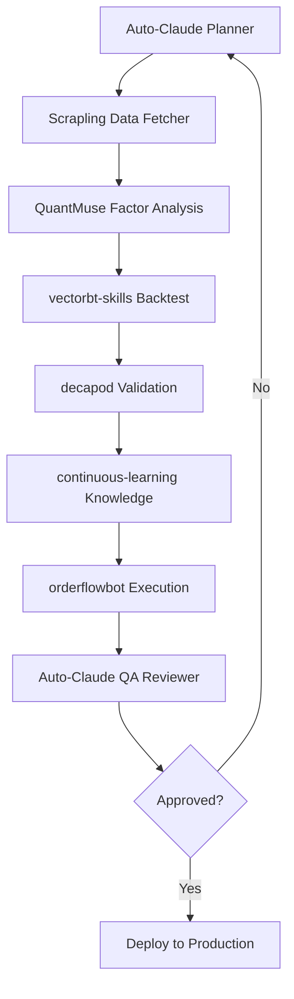
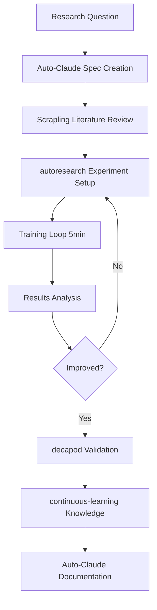

# Integratie Architectuur

## Overzicht

Dit document beschrijft hoe de acht repositories samen kunnen werken voor geavanceerde trading en AI automation toepassingen.

---

## Architectuur Principles

### 1. Modulariteit
Elke repository biedt specifieke, self-contained componenten die onafhankelijk kunnen werken.

### 2. Interoperabiliteit
Componenten gebruiken standaard interfaces (REST API, bestanden, message queues).

### 3. Schaalbaarheid
Architectuur ondersteunt zowel lokale development als productie omgevingen.

### 4. Veiligheid
decapod control plane zorgt voor boundaries en verification op alle niveaus.

---

## High-Level Architectuur

```
┌─────────────────────────────────────────────────────────────────────┐
│                        CONTROL LAYER                                 │
│  ┌──────────────┐  ┌──────────────┐  ┌──────────────────────────┐  │
│  │  Auto-Claude │←→│   decapod    │←→│ continuous-learning-skill│  │
│  │  (Agents)    │  │  (Control)   │  │    (Knowledge)          │  │
│  └──────────────┘  └──────────────┘  └──────────────────────────┘  │
└─────────────────────────────────────────────────────────────────────┘
                              ↓
┌─────────────────────────────────────────────────────────────────────┐
│                         PROCESSING LAYER                             │
│  ┌──────────────┐  ┌──────────────┐  ┌──────────────────────────┐  │
│  │ autoresearch │  │  Scrapling   │  │      QuantMuse           │  │
│  │   (ML Ops)   │  │  (Scraping)  │  │   (Trading Engine)      │  │
│  └──────────────┘  └──────────────┘  └──────────────────────────┘  │
└─────────────────────────────────────────────────────────────────────┘
                              ↓
┌─────────────────────────────────────────────────────────────────────┐
│                         EXECUTION LAYER                              │
│  ┌──────────────┐  ┌──────────────┐  ┌──────────────────────────┐  │
│  │vectorbt-skills│  │orderflowbot  │  │      External APIs       │  │
│  │  (Backtest)  │  │  (Execute)   │  │  (Brokers, Exchanges)    │  │
│  └──────────────┘  └──────────────┘  └──────────────────────────┘  │
└─────────────────────────────────────────────────────────────────────┘
```

---

## Use Case 1: Autonomous Trading Strategy Development

### Flow



### Component Integratie

| Stap | Component | Verantwoordelijkheid |
|------|-----------|---------------------|
| 1 | **Auto-Claude Planner** | Strategie specificatie creëren |
| 2 | **Scrapling** | Alternative data verzamelen (news, sentiment) |
| 3 | **QuantMuse** | Factor berekening en signal generatie |
| 4 | **vectorbt-skills** | Historische backtesting |
| 5 | **decapod** | Risk checks en validation gates |
| 6 | **continuous-learning** | Strategy performance opslaan als knowledge |
| 7 | **orderflowbot** | Live trading execution |
| 8 | **Auto-Claude QA** | Resultaten valideren |

### Data Flow

```
Market Data (Yahoo/Binance)
    ↓
QuantMuse Data Fetcher
    ↓
Factor Calculator → Feature Store
    ↓
Strategy Engine → Signals
    ↓
vectorbt Backtesting → Performance Metrics
    ↓
decapod Risk Validation
    ↓
orderflowbot Execution → Trades
    ↓
Performance Analysis → continuous-learning
```

### API Contracten

```python
# Data Fetcher Interface
class DataFetcher:
    def fetch(self, symbol: str, start: date, end: date) -> DataFrame:
        pass

# Strategy Interface
class Strategy:
    def generate_signals(self, data: DataFrame) -> Series:
        pass

# Backtest Interface
class Backtester:
    def run(self, strategy: Strategy, data: DataFrame) -> BacktestResult:
        pass

# Execution Interface
class Executor:
    def execute(self, signal: Signal) -> TradeResult:
        pass
```

---

## Use Case 2: AI-Powered Research Automation

### Flow



### Component Integratie

| Stap | Component | Verantwoordelijkheid |
|------|-----------|---------------------|
| 1 | **Auto-Claude** | Research plan creëren |
| 2 | **Scrapling** | Papers en artikelen verzamelen |
| 3 | **autoresearch** | Experimenten uitvoeren |
| 4 | **decapod** | Resultaten verifiëren |
| 5 | **continuous-learning** | Kennis opslaan |
| 6 | **Auto-Claude** | Documentatie genereren |

### Knowledge Graph

```
Research Sessions
    ↓
continuous-learning Extraction
    ↓
Knowledge Graph (Graphiti)
    ↓
Future Research Context
```

---

## Use Case 3: Multi-Asset Trading System

### Architectuur

```
┌─────────────────────────────────────────────────────────────┐
│                     ORCHESTRATION                           │
│                   Auto-Claude Agents                        │
│  - Planner: Create trading plans                            │
│  - Coder: Implement strategies                              │
│  - QA: Validate performance                                │
└─────────────────────────────────────────────────────────────┘
                           ↓
┌─────────────────────────────────────────────────────────────┐
│                      DATA LAYER                             │
│  ┌────────────┐  ┌────────────┐  ┌──────────────┐        │
│  │ Scrapling  │  │ QuantMuse  │  │  External    │        │
│  │ (Alt Data) │  │ (Market)   │  │    APIs      │        │
│  └────────────┘  └────────────┘  └──────────────┘        │
└─────────────────────────────────────────────────────────────┘
                           ↓
┌─────────────────────────────────────────────────────────────┐
│                    ANALYTICS LAYER                          │
│  ┌────────────┐  ┌────────────┐  ┌──────────────┐        │
│  │autoresearch│  │ vectorbt   │  │  QuantMuse   │        │
│  │ (ML Models)│  │(Backtesting)│  │ (Factors)    │        │
│  └────────────┘  └────────────┘  └──────────────┘        │
└─────────────────────────────────────────────────────────────┘
                           ↓
┌─────────────────────────────────────────────────────────────┐
│                    EXECUTION LAYER                          │
│  ┌────────────┐  ┌────────────┐  ┌──────────────┐        │
│  │orderflowbot│  │   decapod  │  │  Brokers     │        │
│  │ (Futures)  │  │ (Control)  │  │   (API)      │        │
│  └────────────┘  └────────────┘  └──────────────┘        │
└─────────────────────────────────────────────────────────────┘
                           ↓
┌─────────────────────────────────────────────────────────────┐
│                    LEARNING LAYER                           │
│              continuous-learning-skill                      │
│         (Performance → Knowledge → Improvement)             │
└─────────────────────────────────────────────────────────────┘
```

### Asset Class Routing

```python
class AssetRouter:
    """Route different asset classes to appropriate handlers"""

    def route(self, symbol: str) -> Executor:
        if self._is_crypto(symbol):
            return QuantMuseBinanceExecutor()
        elif self._is_futures(symbol):
            return OrderFlowBotExecutor()
        elif self._is_equities(symbol):
            return VectorBTExecutor()
        else:
            raise UnknownAssetClass(symbol)
```

---

## Use Case 4: Continuous Improvement Loop

### Feedback Architectuur

```
┌──────────────────────────────────────────────────────────────┐
│                    IMPROVEMENT PIPELINE                      │
│                                                               │
│  1. EXECUTION                                                │
│     └─ Trading strategies run live                           │
│                                                               │
│  2. OBSERVATION                                              │
│     └─ Performance metrics collected                         │
│                                                               │
│  3. ANALYSIS                                                 │
│     └─ autoresearch analyzes what worked/failed             │
│                                                               │
│  4. KNOWLEDGE EXTRACTION                                     │
│     └─ continuous-learning extracts patterns                │
│                                                               │
│  5. IMPROVEMENT                                              │
│     └─ Auto-Claude creates better versions                  │
│                                                               │
│  6. VALIDATION                                               │
│     └─ decapod verifies improvements                         │
│                                                               │
│  7. DEPLOYMENT                                               │
│     └─ New strategies deployed                               │
│                                                               │
└──────────────────────────────────────────────────────────────┘
```

### Knowledge Graph Schema

```typescript
interface StrategyPerformance {
  id: string
  strategy: Strategy
  metrics: PerformanceMetrics
  market_conditions: MarketConditions
  timestamp: Date
}

interface Pattern {
  type: 'success' | 'failure'
  conditions: MarketCondition[]
  outcome: PerformanceMetrics
  confidence: number
}

interface Improvement {
  from_strategy: Strategy
  to_strategy: Strategy
  improvement_pct: number
  validated_by: 'decapod' | 'human'
}
```

---

## Technologie Stack Mapping

### Backend Services

| Service | Technology | Repository |
|---------|-----------|------------|
| Agent Orchestration | Python 3.12+ | Auto-Claude |
| Control Plane | Rust 1.85 | decapod |
| Data Processing | Python 3.10+ | QuantMuse |
| ML Training | Python 3.10+, PyTorch | autoresearch |
| Web Scraping | Python 3.10+ | Scrapling |

### Frontend

| Component | Technology | Repository |
|-----------|-----------|------------|
| Desktop UI | Electron + React | Auto-Claude |
| Dashboard | Streamlit | QuantMuse |
| Web API | FastAPI | QuantMuse |

### Data Storage

| Type | Technology | Repository |
|------|-----------|------------|
| Knowledge Graph | Graphiti/LadybugDB | Auto-Claude |
| Time Series | PostgreSQL | QuantMuse |
| Cache | Redis | QuantMuse |
| Experiment Logs | TSV + Git | autoresearch |

---

## Deployment Architectures

### Development Environment

```
Local Machine
├── Auto-Claude (Desktop App)
├── Python Environment
│   ├── QuantMuse
│   ├── vectorbt-skills
│   ├── Scrapling
│   └── autoresearch
├── Rust Environment
│   └── decapod CLI
└── NinjaTrader
    └── orderflowbot
```

### Production Environment

```
Cloud Infrastructure
├── Kubernetes Cluster
│   ├── Auto-Claude Backend (Pods)
│   ├── QuantMuse API Server
│   ├── decapod Control Plane
│   └── Scrapling Workers
├── Message Queue (Redis/RabbitMQ)
├── Database (PostgreSQL)
├── Knowledge Graph (Graphiti)
└── Monitoring (Prometheus + Grafana)
```

---

## Communicatie Protocollen

### Synchronous (HTTP/REST)

```python
# QuantMuse API → VectorBT
POST /api/backtest
{
  "strategy": "...",
  "data": {...},
  "parameters": {...}
}
→ BacktestResult
```

### Asynchronous (Message Queue)

```python
# Auto-Claude → Scrapling
queue.publish("scraping.jobs", {
  "url": "...",
  "selector": "...",
  "callback": "..."
})

# Scrapling → QuantMuse
queue.publish("data.update", {
  "symbol": "...",
  "data": [...],
  "source": "scraping"
})
```

### File-Based (TSV/JSON)

```python
# autoresearch → Analysis
results.tsv:
timestamp  val_bpb  description  status
1710420000 2.1234  "Flash Attention test"  success
```

---

## Security Considerations

### decapod Integration Points

```rust
// 1. Agent Initialization
decapod rpc --op agent.init

// 2. Pre-Execution Validation
decapod validate --check "risk_limits"

// 3. Post-Execution Attestation
decapod attest --result "trade_executed"
```

### Permission Model

```
┌─────────────────────────────────────┐
│         PERMISSION LAYER            │
│  ┌──────────────────────────────┐  │
│  │  Read-Only                    │  │
│  │  - Market data access         │  │
│  │  - Historical analysis        │  │
│  └──────────────────────────────┘  │
│  ┌──────────────────────────────┐  │
│  │  Write-Restricted             │  │
│  │  - Strategy creation          │  │
│  │  - Experiment logging         │  │
│  └──────────────────────────────┘  │
│  ┌──────────────────────────────┐  │
│  │  Execute-Gated                │  │
│  │  - Trade execution            │  │
│  │  - Production deployment      │  │
│  └──────────────────────────────┘  │
└─────────────────────────────────────┘
```

---

## Monitoring en Observability

### Metrics Collection

```python
# Auto-Claude Agent Metrics
agent_tasks_completed
agent_tasks_failed
agent_execution_time

# QuantMuse Trading Metrics
strategy_sharpe_ratio
strategy_max_drawdown
orders_executed
orders_failed

# autoresearch ML Metrics
experiment_val_bpb
experiment_success_rate
gpu_utilization
```

### Health Checks

```python
# System Health
GET /health
{
  "status": "healthy",
  "components": {
    "auto_claude": "ok",
    "quantmuse": "ok",
    "decapod": "ok",
    "database": "ok"
  }
}
```

---

## Next Steps voor Implementatie

### Fase 1: Basis Infrastructuur
1. Installatie van alle dependencies (zie DEPENDENCIES.md)
2. Setup van communicatie kanalen (REST, message queue)
3. Basis integratie van Auto-Claude + decapod

### Fase 2: Data Pipeline
1. Scrapling + QuantMuse integratie
2. Data normalization en storage
3. Real-time data streaming

### Fase 3: Strategy Development
1. vectorbt-skills setup
2. Eerste strategy backtesting
3. Performance monitoring

### Fase 4: Execution
1. orderflowbot integratie
2. Paper trading
3. Live trading (met decapod gates)

### Fase 5: Continuous Learning
1. continuous-learning-skill activatie
2. Knowledge graph opbouw
3. Automatische strategie verbetering

---

**Documentatie versie:** 1.0.0
**Laatste update:** 2026-03-14
